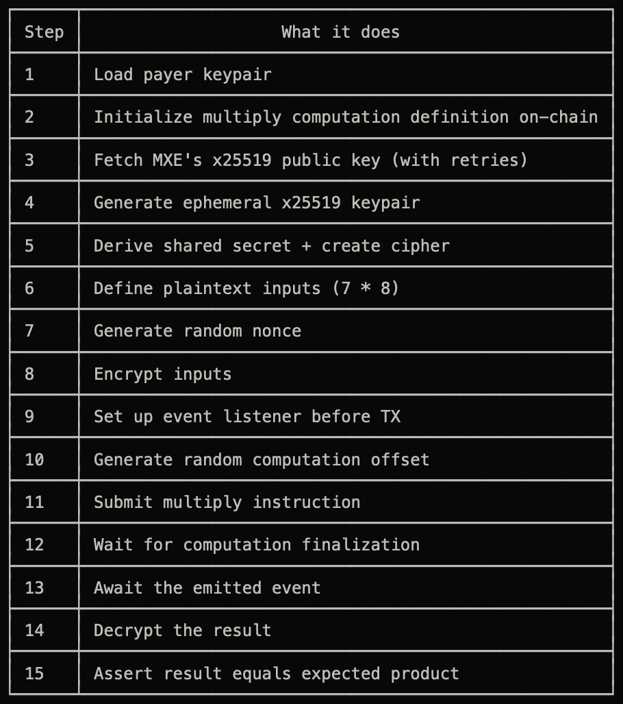

# hello_world

A confidential Solana app built with Arcium: an Anchor program queues computations, and Arcis instructions define the confidential logic.

## Quickstart

```bash
arcium build
arcium test
```

## Layout

| Path | Purpose |
|------|---------|
| `programs/hello_world/` | Anchor program: queues computations, handles callbacks |
| `encrypted-ixs/` | Arcis confidential instructions |
| `tests/hello_world.ts` | TypeScript integration tests |
| `Arcium.toml` | Localnet and cluster configuration |

## Steps to write tests 


## Docs

<https://docs.arcium.com/developers>
